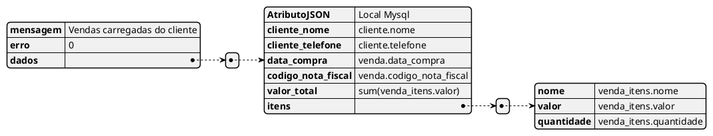

# Atividade 3

- [ ] Fazer a rota get http://127.0.0.1:8000/cliente/${cliente}/gerar-vendas

Deve retornar um json com os dados da venda do `cliente id=1`.

Atenção para "dados" e "itens" são arrays de objetos com respectivos valores.

Essa consulta pode ser feita em RAW Query ou Entity. (Deve ser utilizado joins/left joins)

_Caso finalizar todos os itens pode voltar a este e transformar em Entitys / Relacionamento entre elas._

Exemplo url com o id do cliente 1: http://127.0.0.1:8000/cliente/1/gerar-vendas

Abaixo o modelo do json aguardado

```
{
    "mensagem":"Vendas carregadas do cliente",
    "erro": 0,
    "dados":
    [{
        "AtributoJSON" : "Local Mysql",
        "cliente_nome" : "cliente.nome",
        "cliente_telefone" : "cliente.telefone",
        "data_compra" : "venda.data_compra",
        "codigo_nota_fiscal" : "venda.codigo_nota_fiscal",
        "valor_total" : "sum(venda_itens.valor)",
        "itens" : [{
            "nome" : "venda_itens.nome",
            "valor" : "venda_itens.valor",
            "quantidade" : "venda_itens.quantidade"
        }]
    }]
}
```

Representação gráfica


**Atenção**
- [ ] Caso o ID não for encontrado deve voltar um error conforme abaixo:

```
{
    "mensagem":"Cliente não encontrado",
    "erro": 1,
    "dados": null
}
```

(Evidências no evidencia.doc)

- [ ] - Consulta retornando o json
- [ ] - Exception consultando o cliente id: 991

---

Fim atividade 3
